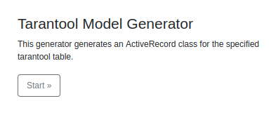

GII
======================================
There are several ways to use gii generator with tarantool database:
- Generation **\mhthnz\tarantool\ActiveRecord** models by tarantool tables
- Generation controllers by **ActiveRecord** models
- Generation SearchModels by **ActiveRecord** models

### [GII Documentation](https://www.yiiframework.com/doc/guide/2.0/en/start-gii)

Configuration
--------------------------------------

```php
return [
    'bootstrap' => ['gii'],
    'modules' => [
        'gii' => [
            'class' => 'yii\gii\Module',
            'allowedIPs' => ['*'],
            'generators' => ['tarantoolModel' => \mhthnz\tarantool\gii\Generator::class],
        ],
    ],
]
```
Go to `/gii` and you will see:


